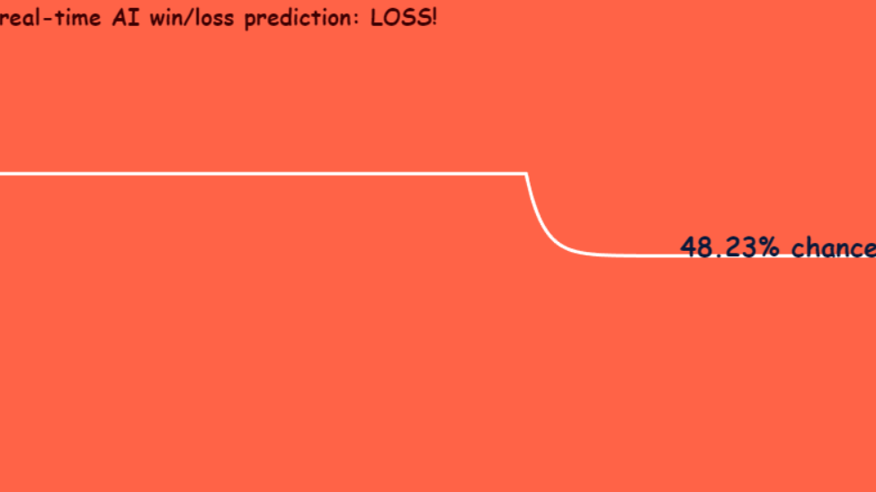

# 📈📉 Fake Win/Loss prediction, with controllable input

## Why?
Made for fun, and to use Elysia and Svelte for the first time. Who doesn't like to watch a line go up and down? *PS: made quick and dirty!*

## How
1. Start backend by going to `backend/` and running `bun run dev`
2. Start frontend by going to `frontend/` and running `bun run dev`
3. Visit `localhost:5173` to see the fake prediction algorithm in action and visit `localhost:5173/set` to set a value.

## Stack
* Bun as the runtime
* SvelteKit in the frontend
* Elysia backend